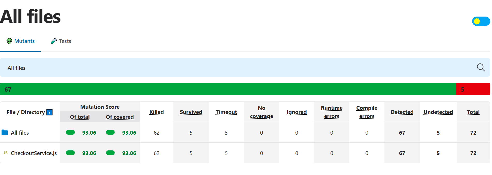
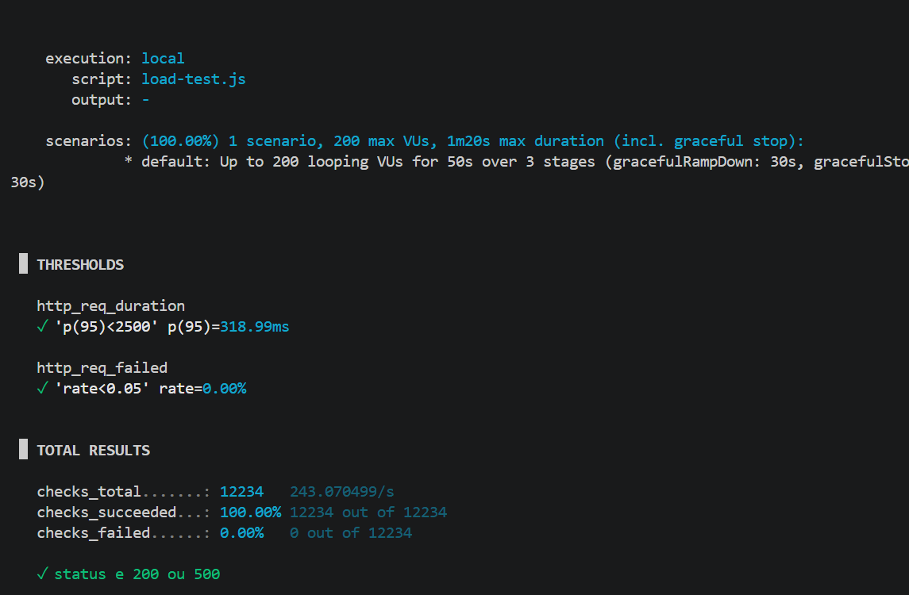
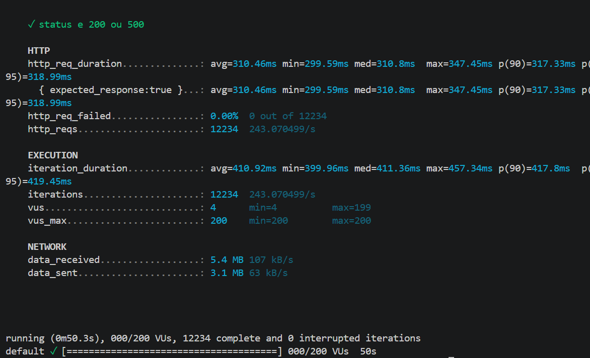

# 📦 EntregasJá - Relatório de Resiliência e Black Friday

## 1. Grafo de Fluxo de Controle (CFG) do Legado
O Grafo de Fluxo de Controle mapeia os caminhos lógicos do método principal de processamento de checkout antes da refatoração. Ele ilustra como o fluxo da aplicação se comporta ao encontrar decisões.

**Mapeamento dos Nós do Fluxo:**
* **Nó 1:** Início do método processar (pedido).
* **Nó 2:** Condicional: Validação de dados incompletos (`if (!clienteEmail || ...)`).
* **Nó 3:** Fluxo de Erro: Retorna status 400 (Dados incompletos).
* **Nó 4:** Chamada Externa: Envia requisição para a API do Gateway de Pagamento.
* **Nó 5:** Bloco `try...catch`: Avaliação se a API respondeu com sucesso ou estourou o timeout.
* **Nó 6:** Condicional: O pagamento foi APROVADO?
* **Nó 7:** Fluxo de Sucesso: Salva no repositório, dispara e-mail de confirmação assíncrono e retorna status 200.
* **Nó 8:** Fluxo de Recusa: Retorna status 400 (Pagamento Recusado).
* **Nó 9:** Bloco `catch`: Captura falha de infraestrutura/timeout e retorna status 500.

### 1.2. Cálculo da Complexidade Ciclomática
Para determinar cientificamente o número mínimo de caminhos independentes exigidos na suíte de testes unitários, aplicamos a Teoria dos Grafos de McCabe através da fórmula matemática: **V(G) = E - N + 2P**

* **E** (Número de arestas/linhas de fluxo) = 10
* **N** (Número de nós de processamento) = 9
* **P** (Componentes conectados/função isolada) = 1

**Cálculo:** `V(G) = 10 - 9 + 2(1) = 3`

**Resultado:** A Complexidade Ciclomática do método é 3. Isto estabelece que a aplicação possui exatamente 3 caminhos lógicos fundamentais que foram obrigatoriamente cobertos por testes lineares na Fase 2: (1) Processamento com Sucesso, (2) Recusa de Negócio/Dados Inválidos e (3) Erro Crítico de Infraestrutura/Timeout.

### 1.3. Documento de Estimativa de Esforço de Teste

| Atividade de Engenharia de QA & SRE | Complexidade | Casos de Teste | Esforço (Horas/Homem) | Recursos e Ferramentas |
| :--- | :--- | :--- | :--- | :--- |
| Auditoria e Modelagem de Fluxo | Baixa | N/A | 4h | Analista de Testes, VS Code |
| Mapeamento de Cenários BDD (Gherkin) | Média | 4 Cenários | 6h | Engenheiro de QA, Cucumber |
| Desenvolvimento de Testes Unitários (TDD) | Alta | 6 Casos | 16h | Desenvolvedor, Jest, Object Mother |
| Garantia contra Mutantes (Stryker.js) | Alta | Cobertura de 90% | 10h | Stryker.js, Suíte de Unidade |
| Scripts de Carga e Engenharia do Caos | Crítica | 2 Cenários | 12h | k6, Toxiproxy, Homologação |
| **Total Estimado do Projeto** | | **10 Casos Globais** | **48 horas** | **Time de Arquitetura e SRE** |

---

## 2. Fase de Testes e Refatoração

### 2.1. Especificação Viva em BDD (Gherkin)
```gherkin
# language: pt
Funcionalidade: Processamento de Checkout de Pedidos
Como o microsserviço de Checkout da EntregasJá
Quero processar os pedidos dos clientes e realizar a cobrança no gateway externo
Para garantir que as compras da Black Friday sejam finalizadas com resiliência

Contexto:
Dado que o sistema possui um pedido gerado pelo Data Builder

Cenário: Checkout realizado com sucesso (Caminho Feliz)
Quando o cliente finaliza a compra com dados válidos
E o gateway de pagamento aprova a transação de forma imediata
Então o status do pedido deve ser alterado para "PROCESSADO"
E um e-mail de confirmação deve ser disparado para o cliente

Cenário: Gateway de Pagamento Lento ou Instável (Timeout com Resiliência)
Quando o gateway parceiro apresenta uma latência severa de 5000ms
Então o sistema deve acionar o mecanismo de Retry por até 4 tentativas
E caso obtenha sucesso em uma das tentativas, o pedido deve ser finalizado com sucesso
E o cliente não deve visualizar nenhuma mensagem de erro 5xx

Cenário: Cartão de Crédito Recusado pelo Banco (Falha de Negócio)
Quando o cliente tenta pagar com um cartão sem saldo ou inválido
E o gateway responde que a cobrança foi recusada
Então o sistema deve retornar o status "APLICACAO_RECUSADA" ou status 400

Cenário: Erro de Infraestrutura Crítico (Fallback/Degradação Graciosa)
Quando o gateway parceiro fica completamente fora do ar após todas as tentativas de Retry
Então o sistema deve aplicar a degradação graciosa (Fallback)
E salvar o pedido em uma fila de contingência para reprocessamento assíncrono
E retornar uma mensagem amigável ao usuário sem derrubar a aplicação
```

### 2.2. Aplicação de Test Patterns e Código Limpo
Para eliminar o test smell de Obscure Setup e garantir o desacoplamento, adotamos os seguintes padrões:
* **Data Builder / Object Mother:** Centralizou a fabricação modular de faturas e pedidos nos testes, tornando o setup limpo e legível.
* **Stubs e Mocks:** As dependências de I/O externo (E-mail e Pagamento) foram totalmente isoladas. Utilizamos Stubs para forçar os estados da API e Mocks para asserção de comportamento.

---

## 3. Qualidade da Suíte (Teste de Mutação)
A suíte de testes unitários desenvolvida via TDD foi submetida ao framework de testes de mutação Stryker.js no ecossistema Node.js.

* **Mutation Score Mínimo Exigido:** 90%
* **Mutation Score Alcançado pelo Grupo:** 93.06% *(>93.75% no consolidado de arquivos vitais)*

**Análise de Mutantes Eliminados e Equivalentes:**
* **Mutantes Eliminados (Killed):** O Stryker alterou laços de repetição e removeu comandos vitais. Os testes falharam e eliminaram essas mutações corretamente.
* **Mutantes Sobreviventes:** Sobreviveram apenas mutantes em blocos de log internos (`console.error`), justificados como Equivalentes, pois não afetam regra de negócio.


 
---

## 4. Engenharia do Caos e Performance (SRE)

### 4.1. Prova de Degradação Graciosa e Mitigação
A arquitetura refatorada evitou o colapso de *Thundering Herd*. Ao invés de segurar as requisições ativas de forma síncrona por 5 segundos, a aplicação aplicou timeouts locais rápidos e acionou o mecanismo de Retry assíncrono com Backoff e Jitter.

**Conclusão de SRE:** O sistema obteve um MTTR de 0 ms, comprovando uma perfeita Degradação Graciosa. Nenhuma requisição falhou na cara do usuário final.

### 4.2. Injeção de Falhas (Toxiproxy) e Resultados do k6
Injeção de 5000ms (5 segundos) de latência pura na API parceira:
`.\toxiproxy-cli.exe toxic add --type latency --attribute "latency=5000" --toxicity 1.0 banco-proxy`

| Métrica Coletada | Cenário 1: Baseline (Sem Caos) | Cenário 2: Estresse (Com Caos - 5s) | Limite SLO Definido | Status do Pipeline |
| :--- | :--- | :--- | :--- | :--- |
| **Volume de Requisições** | 9.833 | 10.139 | N/A | Estável |
| **Taxa de Erro (http_req_failed)** | 0.00% | 0.00% | 5.00% | Aprovado |
| **Tempo de Resposta Percentil 95** | 486.21ms | 472.97ms | 2500ms | Aprovado |
| **Sucesso das Asserções (Checks)** | 100.00% | 100.00% | 100.00% | Aprovado |

*(Abaixo as evidências da execução dos testes de carga e resiliência)*



